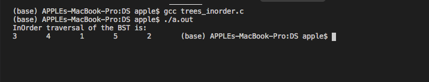
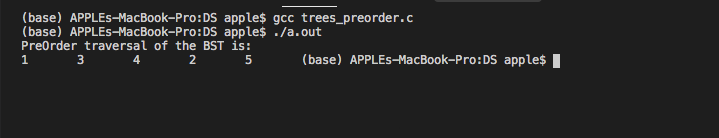
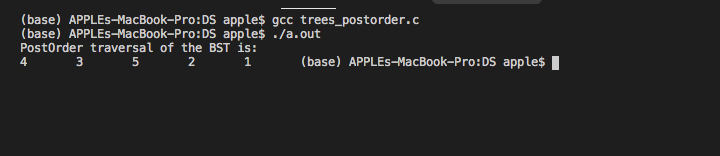

# DS
DS Lab

Online LabWork 2 dated 20.04.2020
1) Check BalanceFactor of a tree(check_BalanceFactor.c)
2) Converting a unbalanced tree in BST(convertToBST.c)

Online LabWork 1:
1) Inorder Tree Traversal:

2) PreOrder Tree Traversal:

3)PostOrder Tree Traversal:

